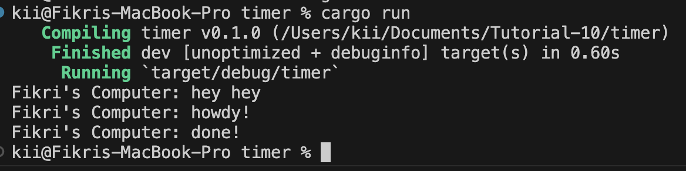
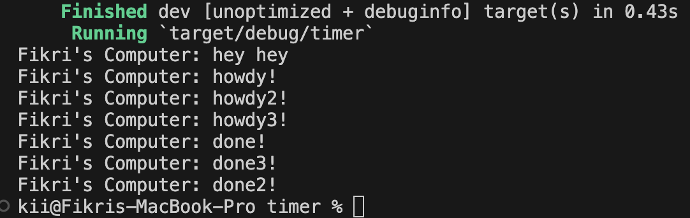
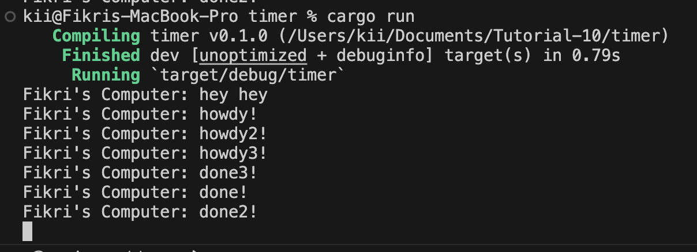

# Tutorial-10: Timer 
## Fikri Dhiya Ramadhana
## 2206819533
## AdvProg-C

### Reflection
1. Understanding how it works  
  
Hal ini terjadi ketika kita menempatkan println di luar spawner yang dimana hal ini menjadikan println di execute terlebih dahulu karena termasuk ke dalam main function sebelum melakukan asynchronous function. 

2. Multiple Spawn  
  
jika dibuat multiple spawner maka tugas yang dikerjakan akan dijalankan serentak dengan spawner lainnya. 

3. Removing statement: drop(spawner);  
  
Saat drop(spawner) dihapus maka main function tidak akan berhenti atau akan selalu menunggu tugas dari spawner sehingga meskipun tugas sudah dijalan semua namum main function akan tetap terus berjalan.

